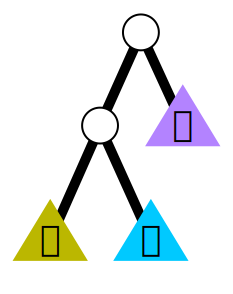

# Reduction rules (triage calculus)

Tree calculus does not necessarily prescibe a specific set of reduction rules and is really a family of calculi as [Barry describes in this blog post](https://github.com/barry-jay-personal/blog/blob/main/2024-12-12-calculus-calculi.md).
Check out [his book](https://github.com/barry-jay-personal/tree-calculus/blob/master/tree_book.pdf) for the _original rules_.

In 2024, Johannes suggested the rules presented here and used throughout this repo. They are a bit easier to motivate (rules 1 and 2 are similar to K and S, rules 3 encapsulate triage) and tend to lead to smaller programs and reduction in fewer steps. We also call tree calculus with these particular rules _triage calculus_.

$$
\begin{alignat*}{6}
& \triangle\ & &\triangle        &&\ y\ & &z                && \longrightarrow     y                       && (1)\\
& \triangle\ &(&\triangle\ x)    &&\ y\ & &z                && \longrightarrow     x\ z\ (y\ z) \quad\quad && (2)\\
& \triangle\ &(&\triangle\ w\ x) &&\ y\ & &\triangle        && \longrightarrow     w                       && (3a)\\
& \triangle\ &(&\triangle\ w\ x) &&\ y\ &(&\triangle\ u)    && \longrightarrow     x\ u                    && (3b)\\
& \triangle\ &(&\triangle\ w\ x) &&\ y\ &(&\triangle\ u\ v) && \longrightarrow     y\ u\ v                 && (3c)
\end{alignat*}
$$

The following visualizations have also been used [here](https://olydis.medium.com/a-visual-introduction-to-tree-calculus-2f4a34ceffc2).

## Implicit applications

Applications are not represented explicitly, reducible subtrees are non-binary trees.
The rules describe how to act on nodes with more than two children.

| Rule | Before                   |                  | After                     |
| -----| ------------------------ | ---------------- | ------------------------- |
| (1)  |   | &LongRightArrow; |   |
| (2)  |   | &LongRightArrow; |   |
| (3a) |  | &LongRightArrow; |  |
| (3b) |  | &LongRightArrow; |  |
| (3c) |  | &LongRightArrow; |  |

## Explicit applications

Applications are represented explicitly as hollow nodes.
The rules describe how to eliminate those application nodes.
Note that application nodes aside, trees are always irreducible values (binary trees).

| Rule | Before                   |                  | After                     |
| -----| ------------------------ | ---------------- | ------------------------- |
| (0a) |  | &LongRightArrow; |  |
| (0b) |  | &LongRightArrow; |  |
| (1)  |   | &LongRightArrow; |   |
| (2)  |   | &LongRightArrow; |   |
| (3a) |  | &LongRightArrow; |  |
| (3b) |  | &LongRightArrow; |  |
| (3c) |  | &LongRightArrow; |  |
